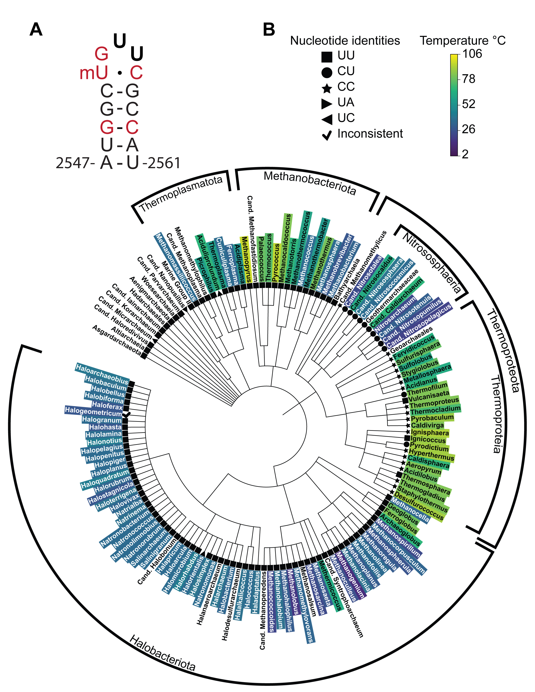

# Variable Sequences in the Archaeal A loop Stabilize the Bacterial Ribosome

This repository holds sequences, data, and scripts used in sequence and phylogenetic analysis for the publication:

"Variable Sequences in the Archaeal A loop Stabilize the Bacterial Ribosome"

Amos J. Nissley, Petar I. Penev, Zoe L. Watson, Jill F. Banfield, and Jamie H. D. Cate

The script [manipulateSILVAtrees.py](manipulateSILVAtrees.py) is used to generate annotation files for iTOL, used in creating [figure 1](Archaea_2554-2555_temp_v2.jpg), based on SILVA taxonomy.

